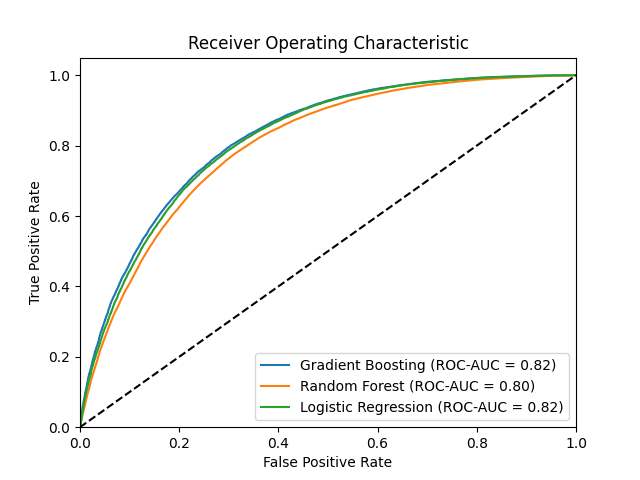

# Diabetes Prediction Using Machine Learning 🩺📊

This project aims to predict the likelihood of an individual having diabetes based on various health indicators using multiple machine learning models: **Random Forest**, **Logistic Regression**, and **Gradient Boosting**. The dataset used comes from the CDC's 2015 Behavioral Risk Factor Surveillance System (BRFSS), with health-related features such as BMI, smoking status, and physical activity.

## Table of Contents 📚
- [Overview](#overview)
- [Dataset](#dataset)
- [Models Used](#models-used)
- [Results](#results)
- [Feature Importance](#feature-importance)
- [Visualizations](#visualizations)
- [How to Run the Code](#how-to-run-the-code)
- [PowerPoint Presentation](#powerpoint-presentation)
- [License](#license)

## Overview
In this project, multiple machine learning models were developed to predict whether an individual is likely to have diabetes or prediabetes based on 21 features. Additionally, **undersampling** was applied to address class imbalance, and **univariate logistic regression analysis** was used to select the most important features.

### Objective:
- Can we predict diabetes risk based on health-related survey data? 🧠
- Which factors are most predictive of diabetes?

## Dataset 📂
The dataset used for this project is the [Diabetes Health Indicators Dataset](https://www.kaggle.com/datasets/alexteboul/diabetes-health-indicators-dataset) from Kaggle. It contains over 250,000 survey responses from the CDC’s 2015 BRFSS survey.

- **Diabetes_012**: Target variable with 3 classes:
  - 0: No diabetes or diabetes during pregnancy
  - 1: Prediabetes
  - 2: Diabetes

For this project, the target was binarized into two classes:
- **0**: No diabetes
- **1**: Prediabetes or diabetes

To handle the class imbalance (more people without diabetes), **undersampling** was applied to reduce the majority class, ensuring balanced training data.

### Key Features:
- BMI (Body Mass Index)
- Age
- Income
- Smoking Status 🚬
- Physical Activity
- General Health
- High Blood Pressure, Cholesterol, etc.

## Models Used
1. **Random Forest Classifier** 🌲:
   - An ensemble method that builds multiple decision trees to make predictions.
   - Provides feature importance to understand which factors have the greatest influence on diabetes risk.
   - Achieved an accuracy of **73.2%**, precision of **71.3%**, and ROC-AUC of **0.80**.

2. **Logistic Regression**:
   - A simple and interpretable linear model for binary classification.
   - Achieved an accuracy of **74.2%**, precision of **73.4%**, and ROC-AUC of **0.81**.

3. **Gradient Boosting**:
   - A powerful ensemble method that iteratively builds decision trees to improve performance.
   - Added after initial models to explore whether boosting would increase predictive performance.
   - Achieved the best accuracy of **74.7%**, precision of **73.0%**, and ROC-AUC of **0.82**.

## Univariate Logistic Regression 📊
Before applying the models, a **univariate logistic regression** analysis was performed to assess the statistical significance of each feature. Only features with a p-value < 0.05 were selected for model building to reduce noise and improve accuracy.

### Selected Features:
- **HighBP**: Odds ratio 2.18, p-value < 0.001
- **Age**: Odds ratio 1.78, p-value < 0.001
- **DiffWalk**: Odds ratio 1.74, p-value < 0.001
- **PhysHlth**: Odds ratio 1.56, p-value < 0.001
- **GenHlth**: Odds ratio 2.49, p-value < 0.001

## Results
- **Random Forest**:
  - Accuracy: **73.2%**
  - Precision: **71.3%**
  - ROC-AUC: **0.80**

- **Logistic Regression**:
  - Accuracy: **74.2%**
  - Precision: **73.4%**
  - ROC-AUC: **0.81**

- **Gradient Boosting**:
  - Accuracy: **74.7%**
  - Precision: **73.0%**
  - ROC-AUC: **0.82**

## Visualizations 📈
The following visualizations help interpret the models' performance:
- **Confusion Matrix**: Shows the true vs. predicted classifications for both models.
- **ROC Curve**: Evaluates the trade-off between true positive rate and false positive rate for both models.

### Confusion Matrix and ROC Curve:
The confusion matrices and ROC curve for all models are shown below:

#### Random Forest


#### Logistic Regression


#### Gradient Boosting


#### ROC Curves


## How to Run the Code
To run this project on your local machine:

1. Clone the repository:
    ```bash
    git clone https://github.com/swimmingbrain/diabetes-prediction.git
    ```

2. Install the required Python packages:
    ```bash
    pip install -r requirements.txt
    ```

3. Run the Python script:
    ```bash
    python project_files/decoding_diabetes_model.py
    ```

4. Check the output for model performance, visualizations, and feature importance.

## PowerPoint Presentation 🎓
You can find a PowerPoint presentation and a PDF export for my university conference summarizing this project [here](project_files/decoding_diabetes_conference.pptx).

## License
This project is licensed under the MIT License - see the [LICENSE](LICENSE) file for details.
